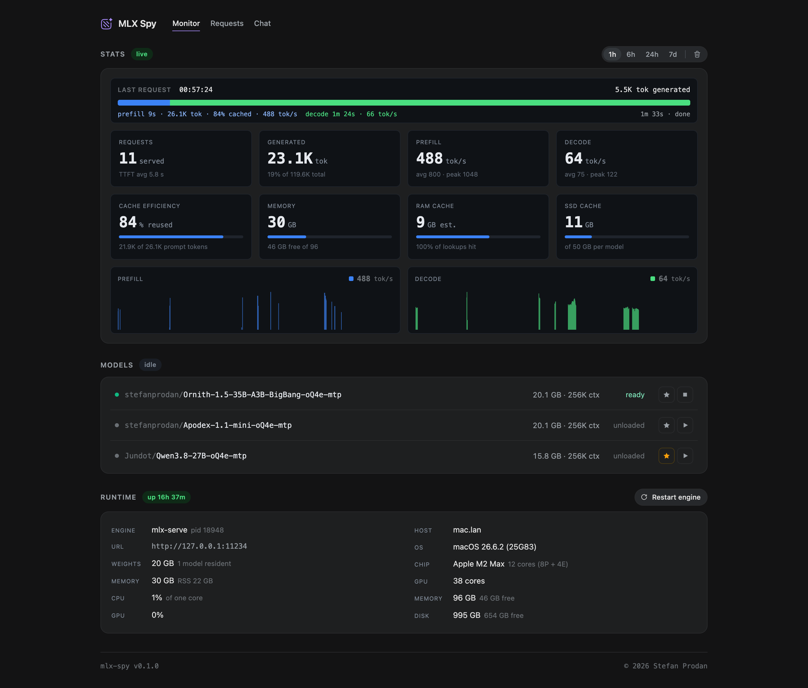
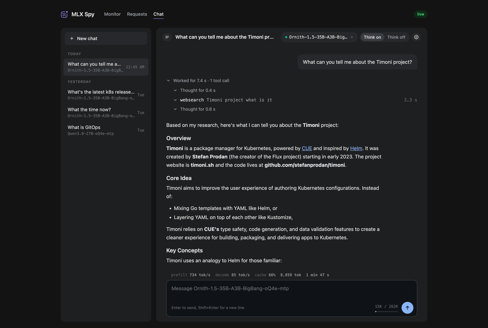

# mlx-spy

Monitoring, control and chat for LLM inference servers on Apple Silicon.

mlx-spy runs next to [mlx-serve](https://github.com/ddalcu/mlx-serve)
and shows what the engine is doing in real time: the request in flight,
the throughput, the caches and the memory, with a week of history behind
them and a chat that streams through it. A single Bun binary, no
dependencies.

## Features

**Monitor**

- Live prefill and decode tok/s, requests served, tokens generated, time
  to first token, and the cache efficiency the engine reports.
- The memory split: engine footprint, weights, the RAM prefix cache and
  the SSD cache tier against their budgets.
- Charts with a shared cursor and a 1h, 6h, 24h and 7d range.
- The request in flight as a live bar: prefill, cached share, decode.
- The models table: load, unload, set the default, favorite; restart the
  engine and clear its disk cache from the page.
- The runtime panel: engine pid, RSS, CPU and GPU next to the host's
  chip, memory and disk.

**Requests**

- The last 50 requests with their prompt and generated tokens, cached
  share, prefill and decode rates, time to first token and duration.

**Chat**

- Replies stream on the server into mlx-spy's database, so a reload, a
  second tab or the phone picks a reply up where it is.
- Stop works from anywhere at any point, and the text so far is kept.
- The engine's own timings under every reply: prefill and decode tok/s,
  cached share, tokens, duration, and the context used against the
  model's window.
- Thinking on or off and the reasoning effort per chat; reasoning is shown
  in a fold with its time and sent back on later turns.
- Tools the model can call: `get_current_time`, `webfetch` (any page as
  text, sliced so the model can page through it) and `websearch` (Exa or
  Firecrawl per chat, keyless or with your key, with an optional domain
  restriction). Every call shows its argument, its time and its result
  under an "untrusted" label, and each tool can be turned off per chat.
- System prompt, temperature, top p and max tokens per chat; a new chat
  starts on a loaded model so it never cold-loads by accident.
- Markdown rendered on the server, code blocks with a copy button, edit
  and regenerate, chat list with rename and delete.





## Install

Requires Bun 1.4 or newer.

```sh
git clone https://github.com/stefanprodan/mlx-spy
cd mlx-spy
bun install --ignore-scripts
make install-bin        # builds a standalone binary into ~/.local/bin
```

The chat's `websearch` tool works without keys. To use your Exa or
Firecrawl key, put the bare key in `~/.local/secrets/exa.key` or
`~/.local/secrets/firecrawl.key` (next to the binary's directory, mode
600 recommended). The files are read at start, so a change needs a
restart.

## Run

```sh
mlx-spy                                    # engine at http://127.0.0.1:11234
mlx-spy --engine http://studio:11234       # a remote engine
mlx-spy --once                             # one JSON sample on stdout
```

The dashboard binds the host's Tailscale address (else 127.0.0.1) on port
11235. There is no authentication: the tailnet is the boundary. History and
chats live in `~/.mlx-spy/history.sqlite`.

| Flag | Default | Meaning |
|---|---|---|
| `--engine <url>` | `http://127.0.0.1:11234` | engine base URL |
| `--listen <host:port>` | Tailscale address, port 11235 | bind address |
| `--db <path>` | `~/.mlx-spy/history.sqlite` | SQLite file; `:memory:` keeps nothing |
| `--retention <days>` | 7 | sample history kept |
| `--hot-cache-max`, `--disk-cache-max` | from the engine's launchd plist | per-model cache budgets for the tiles, e.g. `16GB` |

Restart engine, clear disk cache and the process probes (pid, RSS, CPU)
only work when the engine runs on the same host.

## Docs

- [Monitor and Requests](docs/monitor.md)
- [Chat](docs/chat.md)
- [API](docs/api.md)
- [Development](docs/development.md)

## License

Apache-2.0
