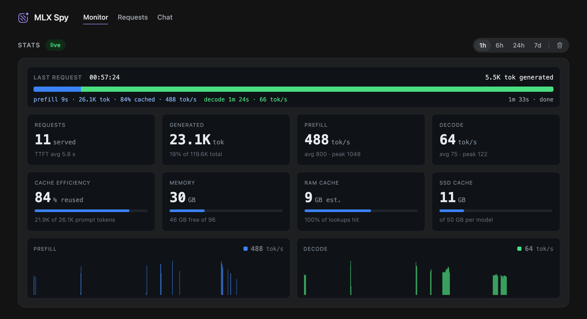

  

# mlx-spy

Monitoring, control and chat for LLM inference servers on Apple Silicon.

mlx-spy runs next to [mlx-serve](https://github.com/ddalcu/mlx-serve)
and shows what the engine is doing in real time: the request in flight,
the throughput, the caches and the memory, with a week of history behind
them and a chat that streams through it. A single Bun binary, no
dependencies.

## Features

**Monitor**

- Live throughput, time to first token and cache efficiency, with charts
  across 1h, 6h, 24h and 7d.
- The memory split: inference engine footprint, weights, the RAM prefix cache
  and the SSD tier against their budgets.
- The request in flight as a live bar: prefill, cached, decode.
- A models table to load, unload, set default and favorite; restart the
  engine and clear its SSD cache.
- A runtime panel: engine pid, RSS, CPU and GPU next to the host's chip,
  memory and disk.

**Requests**

- The last 50 requests with tokens, cached share, rates, time to first
  token and duration.

**Chat**

- Replies stream into sqlite, so a reload, a second tab or the phone
  picks up where it left off.
- The engine's own timings: tok/s, cached share,
  duration and context used against the model's window.
- Thinking on or off and a reasoning effort per chat, with reasoning shown
  in a fold and sent back on later turns.
- Tools the model can call: `get_current_time`, `webfetch` and
  `websearch` (Exa or Firecrawl, keyless or with your key).
- System prompt, temperature, top p and max tokens per chat.
- Server-rendered markdown with copy buttons, edit, regenerate, rename and delete.

  

## Docs

- [Monitor and Requests](docs/monitor.md)
- [Chat](docs/chat.md)
- [API](docs/api.md)
- [Development](docs/development.md)

## License

Apache-2.0
