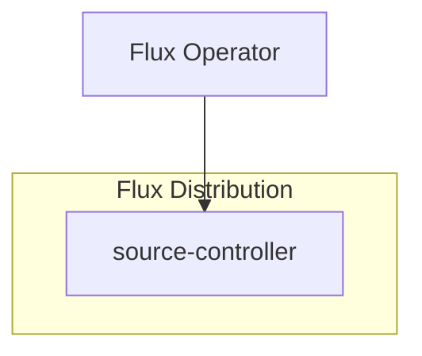

# Beautiful Mermaid dependency patch

Added on 2026-09-10 for `beautiful-mermaid@1.1.3`.
Upstream: [lukilabs/beautiful-mermaid](https://github.com/lukilabs/beautiful-mermaid).
This is a local fix; no upstream issue or pull request has been submitted.

## The bug

Flowcharts can reference a node before declaring its label and shape:



The unpatched library displays `SC` instead of `source-controller`.
Its parser creates a default node for the bare reference, then
`registerNode()` ignores the later explicit definition because the ID
already exists. Explicit redefinitions of labels and shapes are ignored
for the same reason.

This is a parser bug, not a sizing or full-screen viewer problem.
Moving declarations before edges avoids it, but mlx-spy must also render
the original source correctly without rewriting saved messages.

## Patch scope

`patches/beautiful-mermaid@1.1.3.patch` changes `registerNode()` to store
the supplied node even when its ID already exists. The last explicit
definition supplies the label and shape. Bare references remain guarded
by `consumeNode()` and only create a node when its ID is missing, so a
later edge cannot reset a label or shape.

Subgraph tracking is unchanged. Edges continue to use node IDs, and
updating a node does not change its position in the graph's map.

The patch covers both package entry points:

- `src/parser.ts`, used by the package's `bun` export condition, including
  mlx-spy's source runtime and compiled build.
- `dist/index.js`, the published ESM fallback, with the same correction.

mlx-spy still calls the public `renderMermaidSVG()` API. There is no
second parser, source-order normalization, new dependency, or version
upgrade. The renderer's source and SVG limits, style filtering, and
image-only SVG handling in `src/diagram.ts` are unchanged.

## Reproducible installation

`package.json` registers the patch under `patchedDependencies`, and
`bun.lock` records the same mapping. Keep these files and the patch together.
A normal install applies it automatically:

```sh
bun install --frozen-lockfile --ignore-scripts
make lint
make test
make build
```

To revise the patch, first prepare an isolated copy so edits cannot
affect Bun's shared package cache:

```sh
bun patch beautiful-mermaid@1.1.3 --ignore-scripts
# Edit the two files in node_modules/beautiful-mermaid.
make lint
make test
bun patch --commit beautiful-mermaid@1.1.3 --ignore-scripts
```

Here `--commit` writes the dependency patch and updates Bun's metadata;
it does not create a Git commit. See [Bun's patch documentation](https://bun.com/docs/pm/cli/patch).

Restart the local preview with `make preview` after changing the
dependency. For the Studio, use the normal `make deploy-studio` path
when deployment is requested. Restarting clears the in-memory SVG
cache. Reopening or refreshing an existing chat renders its saved
Markdown again, so no database migration, message edit, or new engine
request is needed.

## Regression coverage

`test/fixtures/diagrams/flux-operator.mmd` preserves the original failing
source, with the edge chains before the labeled subgraph declarations.
`test/diagram.test.ts` covers:

- All 19 node labels, four subgraphs and their membership, and 18 edges.
- Replacing placeholder labels and shapes with explicit definitions.
- Last explicit definition wins; subsequent bare references do not
  overwrite it.
- Matching behavior in the Bun export and the ESM fallback.

The existing rendering tests also cover other diagram types, escaping,
style filtering, resource limits, and caching.

## Removing the patch

Submit the minimal reproduction and correction upstream, then record
the issue or pull request here. Submission has not happened yet.

Once an official npm release contains equivalent behavior and has
passed the repository's 24-hour release cooldown:

1. Pin that exact version, remove the old `patchedDependencies` entry and
   patch file, and regenerate `bun.lock` with `bun install --ignore-scripts`.
2. Keep the regression fixture and assertions. Run `make lint`,
   `make test`, and `make build` against the unpatched release.
3. Open the existing diagram in the preview, including its full-screen
   view. Only retire the workaround when labels, shapes, subgraphs, and
   edges remain correct.
4. Update this document with the fixed version and upstream reference.
